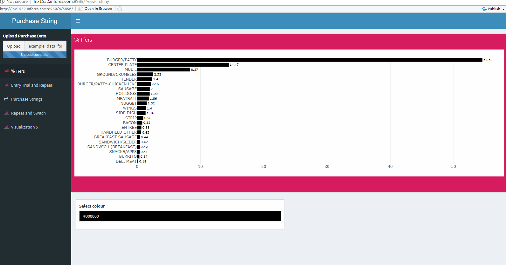
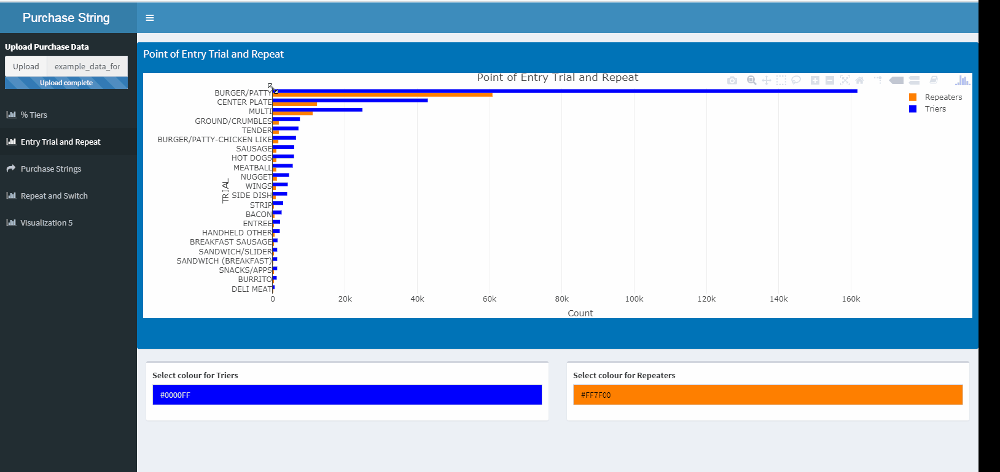
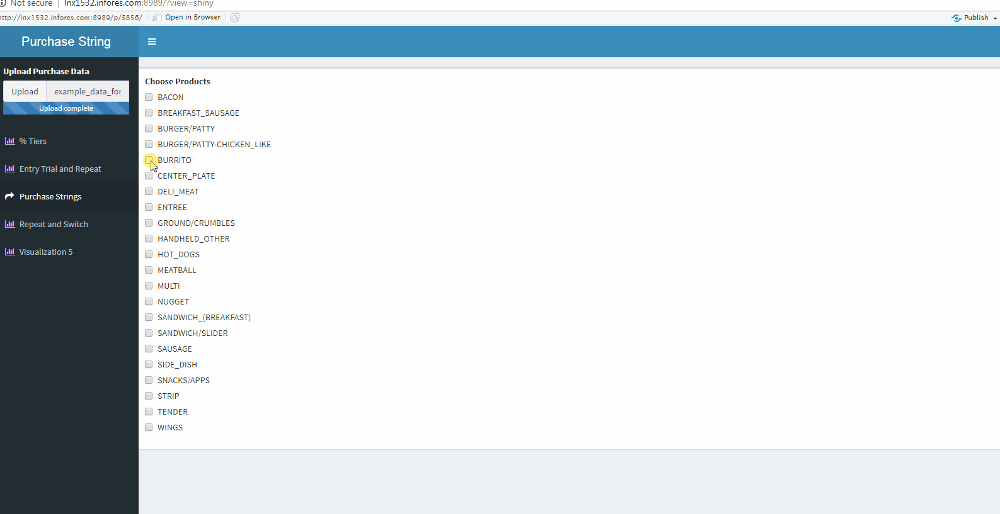

# Purchase String Visualization Generator
## Introduction
The **Purchase String Visualization Generator** is intended to provide an intuitive dashboard for generating and downloading informative graphics on purchase patterns.

Open the [App](https://edwardhuh.shinyapps.io/purchase_string_visualization/)!

## Usage:
### **Changing colors in graphics:**
The application intends to provide users with the ability to resize and change the color of their graph with ease. 

An example of changing colors in the interface:

### **Downloading graphs:**
The application should also allow you to select the best version of the graph you want. Therefore, we support zooming and downloading functionalities for greater versatility.

An example of zooming and downloading graphics in the interface:

### **Generating product specific graphs:**
Select the products you are interested in exploring. Interactivity is particularly useful for this sankey diagram.

An example:



## Bugs and Fixes:
### Changing the Title of Visualizations:
````r
(ui.R)
 dashboardHeader(title = "Purchase String")
 ````
Use to modify the title of the application.

````r
(ui.R)
sidebarMenu(
        # modify first item to alter display name of tabs
        menuItem("% Tiers", tabName = "vis1", 
                 icon = icon("bar-chart")),
        menuItem("Entry Trial and Repeat", tabName = "vis2", 
                 icon = icon("bar-chart")),
        menuItem("Purchase Strings", tabName = "vis3", 
                 icon = icon("share")),
        menuItem("Repeat and Switch", tabName = "vis4", 
                 icon = icon("bar-chart")),
        menuItem("Visualization 5", tabName = "vis5", 
                 icon = icon("bar-chart"))
      )
````
Modify first item to alter display name of tabs

````r
tabItems(
        # First tab content. 
        tabItem(tabName = "vis1",
                fluidRow(
                   box(title = "% Tiers", background = "maroon", 
                       solidHeader = TRUE, plotlyOutput(outputId = "vis1plot"),
                       height = 500, width = 1000),
                   box(colourInput("vis1col", "Select colour", "steelblue", 
                                   palette = c("limited")))
                 )
                ),
````
Do NOT alter 'tabName = "vis1"'. Instead, alter 'title' in box() to change graph title.
The `tabName` is the reference call from server.R to ui.R. So altering this will result in the code breaking.

### Changing the Text Style of labels in the graphic:
````r
# Font specification for all diagrams -----------------------------------------
t <- list(
  family = "serif",
  size = 15)
````
'family' can be altered into other more common font-types.
'size' can be altered to increase or decrease font size.
Additional options such as color can also be explored.

### Changing the color selection of Sankey Diagrams:

The colors in the sankey diagram is determined by the function 
````r
(global.R)
colorScale <- function(count){
  if (count < 8) {
    gplots::col2hex(brewer.pal(count, "Set2"))
  } else{
    cl <- colors(distinct = TRUE)
    set.seed(15887)
    gplots::col2hex(sample(cl, count))
  }
}
````
Altering the `Set2` in `(brewer.pal(count, "Set2"))` will enable you to select from different assortment of colors. Refer to `RColorBrewer` package for such selection options.

### Bar Charts
The general format of the bar-charts follow the plot.ly package format:
````r
(server.R)
    plot_ly(
      x = vis1_df$PERCENT,
      y = vis1_df$TRIAL,
      text = vis1_df$PERCENT,
      textposition = 'outside',
      type = "bar",
      orientation = 'h',
      color = I(input$vis1col)
    ) 
    `````
This means that changes to labels and orientations can be made by consulting documentation in the `plotly` package, or the [Plotly website for Bar charts](https://plot.ly/r/bar-charts/). 

### Sankey Diagrams
The rendering (when the plot actually shows itself in the application) is done by the `renderPlotly` function.
````r
          p <- plot_ly(
            domain = trace1$domain,
            link = trace1$link,
            node = trace1$node,
            type = trace1$type
          ) %>%
            layout(font = t)
            ````
Specifics of the sankey diagram structuring should be done after consulting the (Plotly website on Sankey diagrams)[https://plot.ly/r/sankey-diagram/].

### Dynamic Rendering of Diagrams
Dynamic rendering refers to the method used to generate diagrams based on user input in visualization 3 and 5. 
This process requires the R server to have already generated all the possible graphics, and spit them out on-demand.
The loop that generates all these graphs are shown here:
````r
 for (j in 1:plotcount) {
      # break if there is nothing selected.
      if (iter == 0) {
        break
      }
      local({
        my_j <- j
        plotname <- paste0("bar", my_j)
        
        output[[plotname]] <- renderPlotly({
          switch_grid %>%
            filter(switch_grid$TRIAL == product_list[my_j]) -> subset
          names <- colnames(subset)
          yvals <- names[-1]
          
          names(subset) <- NULL
          xvals <- as.numeric(subset[-1])
          
          vis5_df <- data.frame(yvals, xvals)
          vis5_df$yvals <- factor(vis5_df$yvals, 
                                  levels = unique(vis5_df$yvals)[order(
                                    vis5_df$xvals, decreasing = FALSE)])
          
          p <- plot_ly(
            x = vis5_df$xvals,
            y = vis5_df$yvals,
            # uncomment this if you want to see the count information.
            # text = vis5_df$xvals,
            # textposition = 'outside',
            type = "bar",
            orientation = 'h'
            )  %>%
            layout(#font = t,
                   title = product_list[my_j],
                  # yaxis = list(title = 'Trial Product'),
                   xaxis = list(title = 'COUNT')
                   )
          
          while (!is.null(dev.list())) {
            dev.off()
          }  
          p
        })
      })
      `````
Here, you can see the variable `i` is being used as an iterator on the number of products that are used in the input file. Then, each plot is saved in a global variable called `output` in the form of `output[[plotname]]`.
The command `dev.off()` is essential to ensuring that each graph is generated independently from each other. For more information, please consult the [documentation](https://www.rdocumentation.org/packages/imguR/versions/0.1.5/topics/dev.off).

The `input$product` variable in `server.R` saves the particular selection that is made by the user.
````r
  output$choose_prod1 <- renderUI({
    product_list <- getProd()
    checkboxGroupInput("products", "Choose Products", 
                       product_list)
  })
  ````
This variable is then passed onto the rendering variable as inputs to guide which graphs need to appear in the application:
````r
    total_index <- {}
    for (product in input$products5) {
      index <- grep(glue::glue("^{product}$"), product_list)
      total_index <- c(total_index, index)
      total_index <- unique(total_index)
    }
    plot_output_list <- lapply(total_index, function(i) {
      plotname <- paste0("bar", i)
      plotly::plotlyOutput(plotname)
    })
    # convert the list to a tagList - this is necessary for the list of
    # items to display properly
    
    do.call(tagList, plot_output_list)
````
The inspiration for this idea comes from this [Shiny application](https://gist.github.com/wch/5436415/),
and the following [Stack Overflow question](https://stackoverflow.com/questions/44550521/r-shiny-how-to-loop-output-plotly-graphs).
